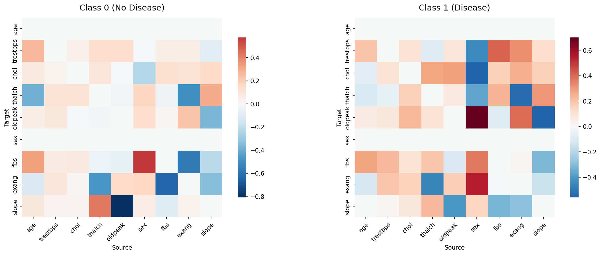
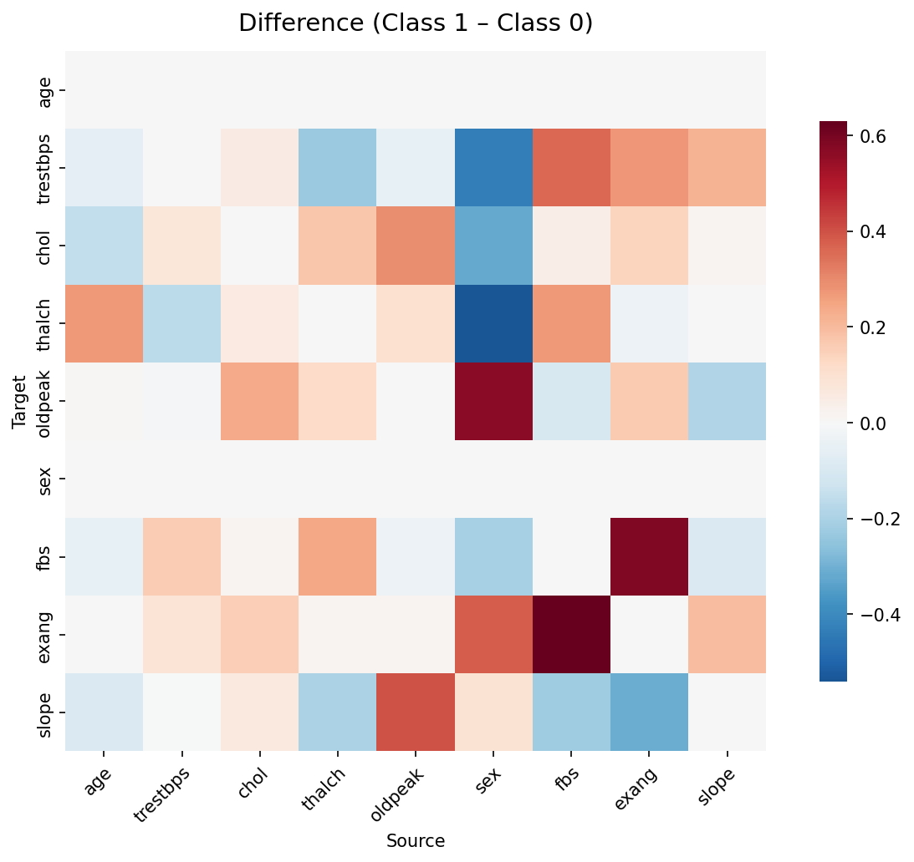
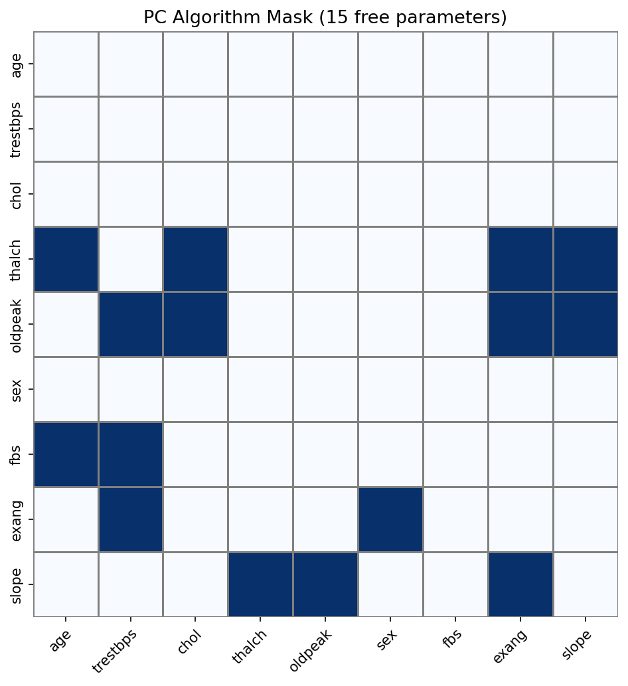
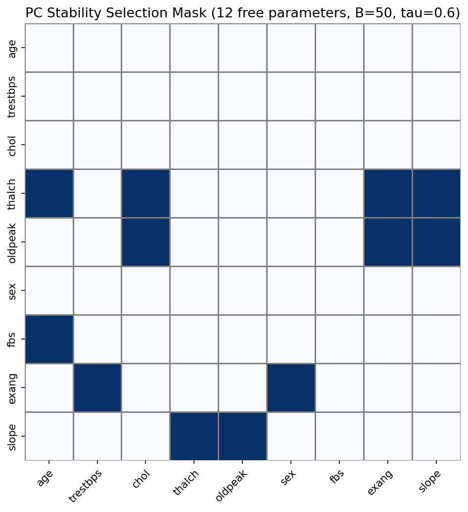
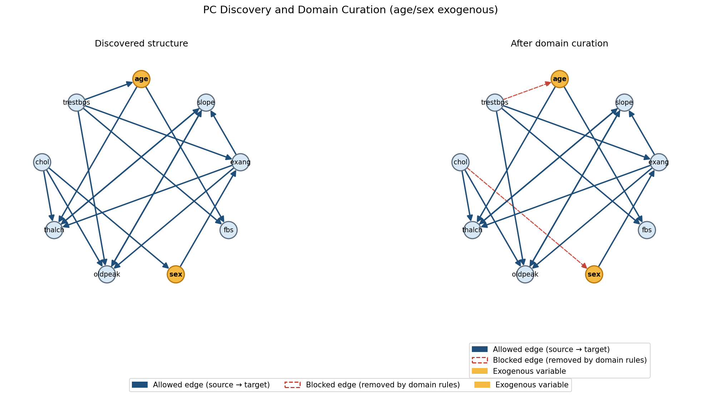
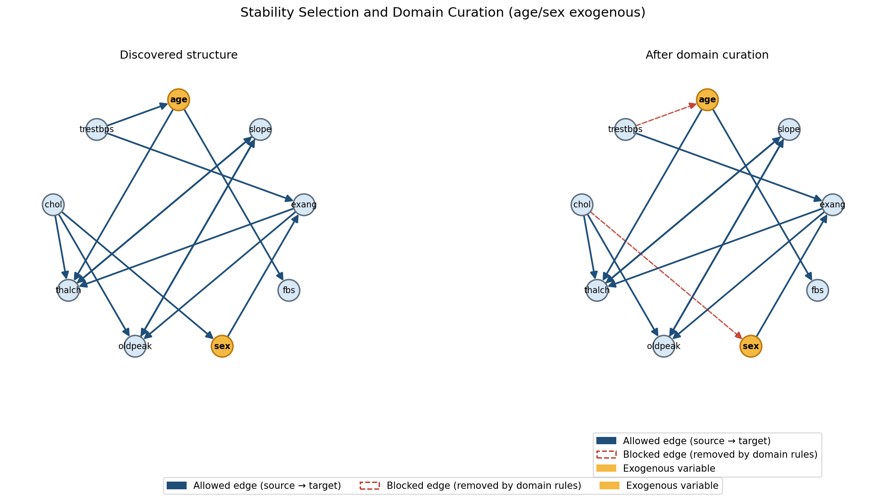
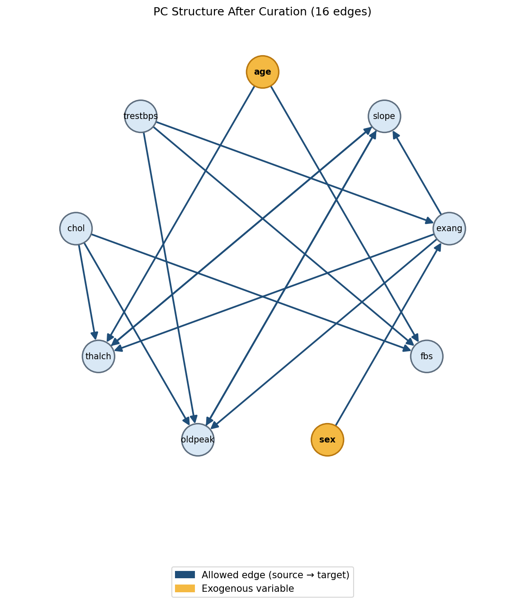
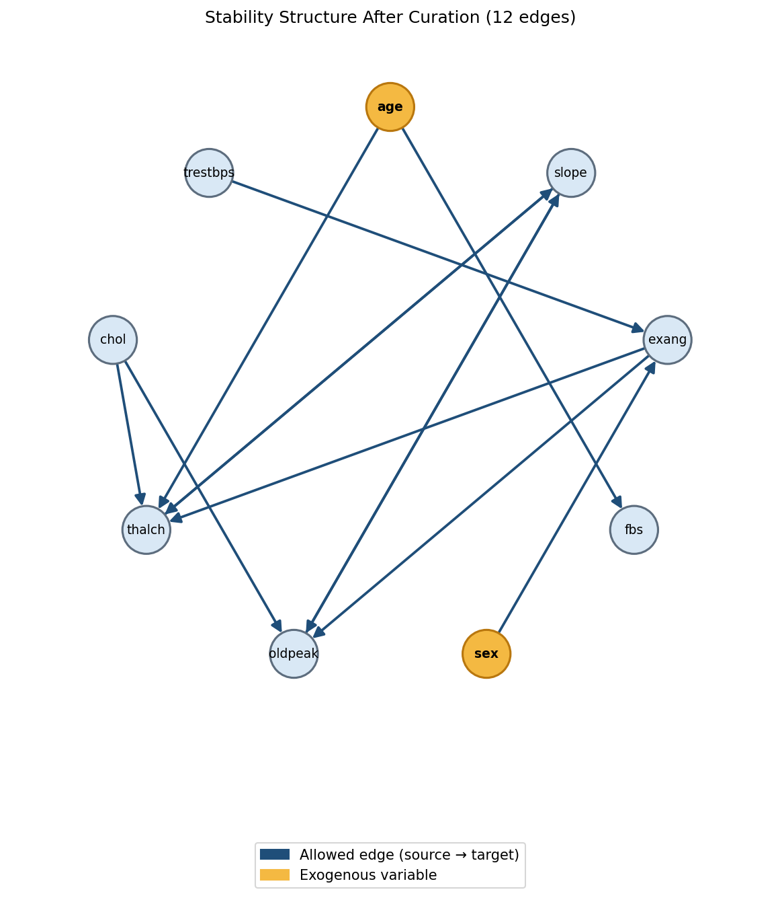

# Geometry-Aware Generalized Fisher Kernel

The pipeline fits **class-specific composite likelihood models** under a **structural mask**, builds **generalized Fisher score features** from both classes, whitens them with the **inverse Godambe metric** (replacing inverse Fisher information in the classical Fisher kernel), and trains a **logistic regression** classifier on the resulting feature vectors.

---

## Overview

For binary label $y \in \{0,1\}$ and mixed-type feature vector $x \in \mathbb{R}^p$:

1. Choose a structural mask $M$ (hand-specified or data-driven).
2. Fit a separate masked composite model in each class to obtain $\hat\theta_0, \hat\theta_1$.
3. For each observation, compute class-conditional score gradients $g_0(x), g_1(x)$.
4. Build $\Phi(x)$ by concatenating raw gradients or **geometry-aware** gradients whitened with $(G_k)^{-1}$.
5. Train logistic regression on $\Phi(x)$.

```
data → mask M → fit θ₀, θ₁ → gradients g₀(x), g₁(x) → Godambe whitening → Φ(x) → logistic regression
```

| Step | Module |
|------|--------|
| End-to-end orchestration | `geometry_fisher/pipeline.py` → `GeometryFisherClassifier` |
| Cross-validation | `geometry_fisher/cross_validation.py` → `CrossValidationExperiment` |
| Experiments & baselines | `examples/run_experiments.py`, `examples/run_experiment2.py`, `examples/run_simulation_study.py` |

---

## Mathematical framework

### Notation

- $p$: number of variables (9 in the Heart Disease benchmark).
- $M \in \{0,1\}^{p \times p}$: binary **structural mask**; $M_{ij}=1$ allows a directed dependency **source $j$ → target $i$**.
- $W \in \mathbb{R}^{p \times p}$: dependency weight matrix; only entries where $M_{ij}=1$ are free parameters, collected in $\theta \in \mathbb{R}^d$, $d = \sum_{ij} M_{ij}$.
- Continuous index set $\mathcal{C}$, ordinal index set $\mathcal{O}$.

Masked linear predictor for variable $i$:

$$
\mu_i(x) = \sum_{j=1}^{p} M_{ij} \cdot W_{ij} \cdot x_j = \bigl[(W \odot M) \cdot x\bigr]_i
$$

**Code:** `composite.py` → `_compute_mu()`, mask applied in `CompositeLikelihoodModel.fit()`.

---

### 1. Structural mask

The mask encodes which conditional dependencies are estimated. Diagonal entries are zero (no self-loops).

| Mask type | How it is built | Code |
|-----------|-----------------|------|
| Hand-specified | Domain knowledge; `age`, `sex` exogenous | `StructuralMask.from_domain_knowledge()` |
| PC algorithm | Single PC run on pooled data (Fisher-Z, $\alpha=0.05$) | `StructuralMask.from_pc_algorithm()` |
| Stability selection | Bootstrap PC + frequency threshold $\tau$ | `StructuralMask.from_stability_selection()` |

Post-discovery curation (equivalent to passing `exogenous` / `forbidden_edges` in `mask_params`):

- **`enforce_exogeneity(["age", "sex"])`** — marks `age` and `sex` as exogenous: all **incoming** edges to those nodes are removed (nothing may predict them). This is applied in **Exp 1 and Exp 2** via `exogenous=["age", "sex"]` in `mask_params`.
- **`block_edges([("chol", "slope")])`** — removes one directed edge; tuple order is `(target, source)`, so this blocks **slope → chol**. Shown here as an **optional example only**; it is **not** used in the reported experiments.

```python
mask = mask.enforce_exogeneity(["age", "sex"])
mask = mask.block_edges([("chol", "slope")])
```

**Code:** `structure.py` → `StructuralMask`, `discover_data_driven_mask()`, `_directed_adjacency_from_pc_graph()`.

---

### 2. Class-specific composite likelihood

For each class $k \in \{0,1\}$, fit a model on $\{x_i : y_i = k\}$ with the **same mask** $M$ but **class-specific** parameters $\theta_k$.

#### Continuous variables ($j \in \mathcal{C}$)

Gaussian negative log-likelihood (up to constants):

$$
\ell_{\mathrm{cont}}(x; \theta) = \frac{1}{2} \sum_{j \in \mathcal{C}} \bigl(x_j - \mu_j(x)\bigr)^2
$$

**Code:** `composite.py` → `_continuous_loss_one()`.

#### Ordinal variables ($j \in \mathcal{O}$)

Ordered probit: categories $c_0 < \cdots < c_{M-1}$ with thresholds $\tau_{j,0} < \cdots < \tau_{j,M-2}$:

$$
P(x_j = c_m \mid x) =
\begin{cases}
\Phi(\tau_{j,0} - \mu_j), & m = 0 \\
\Phi(\tau_{j,m} - \mu_j) - \Phi(\tau_{j,m-1} - \mu_j), & 0 < m < M-1 \\
1 - \Phi(\tau_{j,M-2} - \mu_j), & m = M-1
\end{cases}
$$

where $\Phi$ is the standard normal CDF. The contribution to the loss is $-\log P(x_j \mid x)$.

Thresholds are estimated from the **pooled training data** (both classes) via the empirical CDF and normal quantiles, then **shared** across class-0 and class-1 models.

**Code:** `composite.py` → `_ordinal_neglogprob_one()`, `_ordinal_loss_one()`, `_estimate_thresholds_and_cats()`; shared thresholds passed in `GeometryFisherClassifier.fit()`.

#### Per-observation composite loss

$$
\ell(x; \theta) = \ell_{\mathrm{cont}}(x; \theta) + \sum_{j \in \mathcal{O}} \ell_{\mathrm{ord},j}(x; \theta)
$$

**Code:** `composite.py` → `_total_loss_one()`.

---

### 3. Optimization

For class $k$, with training samples $\{x_i\}_{i=1}^{n_k}$:

$$
Q_k(\theta) = \sum_{i=1}^{n_k} \ell(x_i; \theta) + \lambda \|\theta\|_2^2
$$

Optimization uses **Adam** (Optax) on the free parameters $\theta$ with early stopping. Only masked entries of $W$ are updated.

**Code:** `composite.py` → `CompositeLikelihoodModel.fit()` (`class_objective_theta`, `optax.adam`).

Default hyperparameters: `lambda_reg=0.01`, `learning_rate=0.01`, `max_iter=800` (class 1 uses 600 in the pipeline).

---

### 4. Score gradients (Fisher directions)

At the fitted $\hat\theta_k$, the per-observation score vector is:

$$
g_k(x) = \nabla_\theta \ell(x; \hat\theta_k) \in \mathbb{R}^d
$$

These are the **generalized Fisher score features** before whitening.

**Code:** `composite.py` → `per_observation_gradient()` (JAX `grad` + `vmap`).

---

### 5. Sensitivity matrix $H$ (curvature)

The **sensitivity** (expected Hessian of the composite objective) is approximated by the Hessian of the regularized empirical objective at $\hat\theta_k$:

$$
H_k = \nabla^2_\theta Q_k(\hat\theta_k)
$$

In practice this is computed by automatic differentiation on the same objective used for fitting.

**Code:** `composite.py` → `objective_hessian()` (JAX `hessian`).

---

### 6. Variability matrix $J$

The **variability** (outer product of scores) is the empirical second moment of per-observation gradients:

$$
J_k = \frac{1}{n_k} \sum_{i=1}^{n_k} g_k(x_i) g_k(x_i)^\top = \frac{1}{n_k} G_k^\top G_k
$$

where $G_k \in \mathbb{R}^{n_k \times d}$ stacks score rows.

**Code:** `geometry.py` → `GodambeGeometry.fit()` computes `J_`.

---

### 7. Inverse Godambe metric and geometry-aware whitening

#### Replacing Fisher information

Under a correctly specified likelihood, the classical **Fisher kernel** compares score vectors using the Fisher information matrix $I(\theta)$, equivalently via whitened features $\phi(x) = I(\theta)^{-1/2} s(x)$ (Jaakkola & Haussler, 1998). Composite and pseudo-likelihood objectives break the information-matrix equality ($H \neq J$), so $I(\theta)$ is no longer the appropriate local information matrix.

The **Godambe information matrix** generalizes Fisher information in this setting:

$$
G_k = H_k \cdot J_k^{-1} \cdot H_k
$$

(sensitivity–variability–sensitivity sandwich; see Godambe, 1960; Varin et al., 2011). When the model is well specified, $G_k$ reduces to the Fisher information; under composite likelihood it accounts for both curvature ($H_k$) and score variability ($J_k$).

#### Inverse Godambe metric

The classical Fisher kernel uses **$I(\theta)^{-1}$** as the geometry-defining object. This framework uses the same construction with Godambe information in place of Fisher information: the **inverse Godambe metric**

$$
G_k^{-1} = H_k^{-1} \cdot J_k \cdot H_k^{-1}
$$

defines the local Riemannian geometry for gradient-based features. It is the direct Godambe analogue of inverse Fisher information—not an ad hoc inversion, but the metric that weights each score direction by both objective curvature and observed gradient variability.

With ridge on the Hessian:

$$
H_k^{\mathrm{reg}} = H_k + \gamma I, \quad G_k^{-1} = \bigl(H_k^{\mathrm{reg}}\bigr)^{-1} \cdot J_k \cdot \bigl(H_k^{\mathrm{reg}}\bigr)^{-1}
$$

with default $\gamma = 10^{-3}$ (`ridge_gamma`).

#### Whitening transform

Find $A_k$ such that $A_k^\top A_k = G_k^{-1}$ (symmetric PSD square root via eigendecomposition). The **geometry-aware score** is:

$$
\tilde g_k(x) = A_k \, g_k(x) \in \mathbb{R}^d
$$

In code, scores are row vectors so this is implemented as $\tilde g_k(x) = g_k(x) \cdot A_k^\top$. By construction,

$$
\|\tilde g_k(x)\|_2^2 = g_k(x)^\top G_k^{-1} g_k(x)
$$

so Euclidean distances in feature space reflect the inverse Godambe geometry rather than raw parameter-space coordinates.

**Code:** `geometry.py` → `GodambeGeometry` (`fit()`, `transform()`), helpers `stable_symmetrize()`, `psd_sqrt()`. The fitted attribute `G_inv_` stores $G_k^{-1}$.

---

### 8. Feature map $\Phi(x)$

Each observation is mapped to a feature vector by stacking the class-conditional scores.

**`raw`** — concatenate the unwhitened score vectors from §4:

$$
\Phi(x) =
\begin{bmatrix}
g_0(x) \\
g_1(x)
\end{bmatrix}
$$

**`godambe`** — concatenate the geometry-aware scores $\tilde g_0(x)$, $\tilde g_1(x)$ from §7 (generalized Fisher kernel features):

$$
\Phi(x) =
\begin{bmatrix}
\tilde g_0(x) \\
\tilde g_1(x)
\end{bmatrix}
= \begin{bmatrix}
g_0(x) \cdot A_0^\top \\
g_1(x) \cdot A_1^\top
\end{bmatrix}
$$

Here $g_k(x)$ are the raw score vectors (§4), $A_k$ satisfy $A_k^\top A_k = G_k^{-1}$ (§7), and $\tilde g_k(x) = g_k(x) \cdot A_k^\top$.

**Code:** `features.py` → `build_feature_matrix()`; called from `pipeline.py` → `_build_phi()`.

---

### 9. Classification

Features are standardized on the training fold, then passed to logistic regression:

$$
P(y=1 \mid x) = \sigma\bigl(w^\top z + b\bigr), \qquad
z_j = \frac{\Phi_j(x) - \hat\mu_j}{\hat\sigma_j}
$$

Here $\Phi_j(x)$ is component $j$ of the feature vector from §8, and $\hat\mu_j$, $\hat\sigma_j$ are the **training-fold** mean and standard deviation of that component. The same training statistics are applied at test time. This is the **default protocol** (`scale_phi=True`) and is used in all reported experiments: it stabilizes L-BFGS and puts the two class score blocks on comparable scales before the linear decision rule.

Set `scale_phi=False` only for ablation; it is not the published evaluation setup.

**Code:** `pipeline.py` → `GeometryFisherClassifier.fit()` wraps `StandardScaler` + `LogisticRegression` when `scale_phi=True`.

---

## End-to-end algorithm (code path)

```
GeometryFisherClassifier.fit(X, y, ...)
│
├─ StandardScaler on continuous columns          pipeline.py
├─ Resolve structural mask M                     pipeline.py → structure.py
├─ Estimate shared ordinal thresholds            composite.py
│
├─ CompositeLikelihoodModel.fit(X[y==0], ...)    composite.py  → θ̂₀
├─ CompositeLikelihoodModel.fit(X[y==1], ...)    composite.py  → θ̂₁
│
├─ g₀(x), g₁(x) for all training x               composite.py  → per_observation_gradient
├─ H₀, H₁ from class objectives                  composite.py  → objective_hessian
├─ J₀, J₁ from stacked scores                  geometry.py   → GodambeGeometry.fit
├─ A₀, A₁ from inverse sandwich G⁻¹              geometry.py   → psd_sqrt
│
├─ Φ(x) = build_feature_matrix(...)              features.py
├─ StandardScaler on Φ(x)                        pipeline.py  (scale_phi=True, default)
└─ LogisticRegression.fit(z, y)                  pipeline.py
```

---

## Cross-validation protocol

5-fold stratified CV (`random_state=42`). In each fold:

1. Scale continuous features on the **training fold** only.
2. Estimate ordinal thresholds from **pooled training rows** (both classes).
3. Fit class-0 and class-1 composite models under the same mask.
4. Build Godambe geometry and features on the training fold.
5. **Standardize** $\Phi(x)$ on the training fold (`scale_phi=True`).
6. Fit logistic regression; evaluate on the held-out fold.

For Experiment 2, the mask is discovered **once on the full dataset** (`discover_mask_on="full_data"`) and reused in every fold.

**Code:** `cross_validation.py` → `CrossValidationExperiment`.

---

## Dataset

Nine variables from the UCI Heart Disease file (5 continuous, 4 ordinal). After removing missing values across all four centers: **531 patients** (207 / 324).

| Type | Variables |
|------|-----------|
| Continuous | `age`, `trestbps`, `chol`, `thalch`, `oldpeak` |
| Ordinal | `sex`, `fbs`, `exang`, `slope` |

**Code:** `data/heart_disease_uci.csv`, `data.py` → `load_heart_disease()`.

---

## Installation

```bash
git clone https://github.com/gkouveris14-hub/geometry-aware-fisher-kernel.git
cd geometry-aware-fisher-kernel
pip install -e .
pip install -e ".[baselines]"   # optional: XGBoost
```

---

## Experiments

All tables: **531 samples**, **5-fold stratified CV**, `random_state=42`. Committed results: `docs/results/`.

### Experiment 1 — hand-specified mask (56 parameters)

Compares baselines, raw gradient features, and Godambe whitening under a domain-knowledge mask.

| Method | Accuracy | Macro-F1 | ROC-AUC |
|--------|----------|----------|---------|
| Logistic Regression | 0.780 ± 0.036 | 0.767 ± 0.038 | 0.853 ± 0.030 |
| Random Forest | 0.780 ± 0.021 | 0.768 ± 0.018 | 0.847 ± 0.027 |
| XGBoost | 0.787 ± 0.032 | 0.778 ± 0.031 | 0.830 ± 0.027 |
| Raw gradient features | 0.774 ± 0.026 | 0.760 ± 0.030 | 0.812 ± 0.038 |
| **Godambe whitening** | **0.770 ± 0.018** | **0.757 ± 0.023** | **0.811 ± 0.041** |

```bash
python examples/run_experiments.py
```

Source: [`docs/results/experiment1_results.csv`](docs/results/experiment1_results.csv)

### Experiment 2 — data-driven masks

Same protocol as Exp 1; masks discovered once on full data (`discover_mask_on="full_data"`). Both **Godambe whitening** and **raw gradient features** are reported for each mask.

| Method | Features | Accuracy | Macro-F1 | ROC-AUC | n_params |
|--------|----------|----------|----------|---------|----------|
| PC algorithm (single run) | Godambe | 0.782 ± 0.028 | 0.767 ± 0.031 | 0.846 ± 0.036 | 15 |
| PC algorithm (single run) | Raw | 0.780 ± 0.030 | 0.765 ± 0.032 | 0.849 ± 0.036 | 15 |
| PC stability selection | Godambe | 0.793 ± 0.030 | 0.779 ± 0.034 | 0.849 ± 0.032 | 12 |
| PC stability selection | Raw | 0.789 ± 0.036 | 0.776 ± 0.039 | 0.849 ± 0.031 | 12 |

On Heart Disease, whitening and raw gradients are **equivalent** for both data-driven masks (AUC within fold noise).

PC: Fisher-Z test, $\alpha=0.05$, all columns z-scored, incoming edges to `age`/`sex` blocked. Stability: $B=50$, $\tau=0.6$.

```bash
python examples/run_experiment2.py
```

Source: [`docs/results/experiment2_results.csv`](docs/results/experiment2_results.csv)

### Experiment 3 — when Godambe beats raw (simulation)

Score-level simulation in `geometry_fisher/simulation.py` that isolates the whitening step from composite model fitting. Each of **30 replicates** per sample size proceeds as follows:

1. **Draw geometry.** Sample sensitivity $H \succ 0$ and variability $J \succ 0$ in $\mathbb R^{d \times d}$ ($d=40$), with $H \neq J$ as in composite likelihood.
2. **Build the whitening map.** Compute $G^{-1} = H^{-1} J H^{-1}$ and its symmetric square root $A$ such that $A^\top A = G^{-1}$.
3. **Sample scores.** Draw $n$ raw score vectors $g_i \sim \mathcal N(0, J)$.
4. **Godambe features.** Set $\tilde g_i = A g_i$.
5. **Labels.** Choose a sparse vector $w$ with four nonzero entries and assign $y_i = 1$ if $w^\top \tilde g_i$ exceeds the sample median (roughly balanced classes).
6. **Classification.** Stratified train/test split (35% test). Fit **L2-regularized logistic regression** ($C=0.005$) on raw $g$ and on $\tilde g$, with column standardization applied to each feature set before fitting.

The label depends on a **sparse** linear functional of $\tilde g$ but on a **dense** functional of $g$. Under regularization, Godambe features therefore need fewer samples to reach the same AUC.

| $n$ | Raw Acc | Godambe Acc | Raw AUC | Godambe AUC |
|-----|---------|-------------|---------|-------------|
| 60 | 0.733 ± 0.081 | **0.840 ± 0.086** | 0.836 ± 0.083 | **0.930 ± 0.066** |
| 100 | 0.795 ± 0.083 | **0.881 ± 0.044** | 0.891 ± 0.064 | **0.956 ± 0.033** |
| 160 | 0.807 ± 0.068 | **0.890 ± 0.047** | 0.902 ± 0.050 | **0.961 ± 0.028** |
| 240 | 0.838 ± 0.045 | **0.900 ± 0.036** | 0.927 ± 0.035 | **0.969 ± 0.020** |
| 360 | 0.876 ± 0.041 | **0.917 ± 0.037** | 0.952 ± 0.021 | **0.978 ± 0.020** |

Mean $\|H-J\|/\|H\| \approx 1.0$ across replicates (Fisher equality would give $\approx 0$).

**Takeaway:** Godambe whitening improves **sample efficiency** when the discriminative signal is simple in geometry-aware coordinates. The gap **shrinks as $n$ grows**, consistent with Exp 1–2 on Heart Disease ($n=531$), where raw and Godambe match.

```bash
python examples/run_simulation_study.py
```

Source: [`docs/results/simulation_geometry_results.csv`](docs/results/simulation_geometry_results.csv)

---

## Choosing raw vs Godambe whitening

| Use **`feature_type="godambe"`** when… | **`feature_type="raw"`** is enough when… |
|----------------------------------------|------------------------------------------|
| Sample size per class is **small** relative to mask dimension $d$ | You have **plenty of data** (Heart Disease–scale or larger) |
| Composite / pseudo-likelihood — **$H \neq J$** (check below) | Features are **scaled** downstream (`scale_phi=True`, default) and CV shows no gain |
| You want **geometry-correct** Fisher-kernel features for theory or kernels | You only need a **quick baseline** on the same composite scores |
| Simulation-like regime: regularized linear readout, ill-conditioned raw scores | Raw vs Godambe **AUC difference < 0.02** on your CV |

### Before applying on a new dataset

Run the comparison script on your data (same mask and CV as the final experiment):

```bash
python examples/compare_feature_types.py --mask hand
python examples/compare_feature_types.py --mask pc
```

Checklist:

1. **Problem fit** — Binary outcome; mixed continuous + ordinal columns; you can specify (or learn) which variables may affect which.
2. **Mask** — Hand-specify domain edges, or discover with PC/stability and curate (`exogenous`, optional `forbidden_edges`).
3. **Sample size** — Let $n_{\min} = \min_k n_k$ per class and $d$ = mask parameter count. If $n_{\min} \ll 2d$, prefer Godambe or a sparser mask.
4. **$H$ vs $J$** — The script prints mean $\|H-J\|/\|H\|$ per class. Values **$\gg 0.5$** mean composite curvature and score variability diverge strongly; Godambe is theoretically preferred over Fisher-style shortcuts.
5. **Empirical AUC** — Compare 5-fold CV AUC for `raw` vs `godambe`. If the gain is under 0.02, whitening is optional on that dataset.
6. **Deployment default** — Keep `scale_phi=True` for numerical stability; use `scale_phi=False` only in ablations.

The **structural mask** is usually the main modeling choice for applied users; whitening is the statistically principled metric when steps 3–5 point toward geometry correction.

---

## Usage

### Minimal example

```python
from geometry_fisher import GeometryFisherClassifier, StructuralMask, load_heart_disease

X, y, names, cont_idx, ord_idx = load_heart_disease("data/heart_disease_uci.csv")
mask = StructuralMask.from_domain_knowledge(names, exogenous=["age", "sex"])

clf = GeometryFisherClassifier(
    mask="hand",
    mask_object=mask,
    feature_type="godambe",
    lambda_reg=0.01,
    ridge_gamma=1e-3,
    scale_phi=True,
)
clf.fit(X, y, cont_idx, ord_idx, names)
```

### Data-driven mask (Experiment 2)

Exp 2 passes `exogenous=["age", "sex"]` so incoming edges to `age` and `sex` are blocked after PC or stability discovery. The `forbidden_edges` entry below illustrates optional single-edge removal and is **not** used in the reported results.

```python
clf = GeometryFisherClassifier(
    mask="pc",
    mask_params={
        "alpha": 0.05,
        "exogenous": ["age", "sex"],
        "forbidden_edges": [("chol", "slope")],
    },
    feature_type="godambe",
)
```

```python
clf = GeometryFisherClassifier(
    mask="stability",
    mask_params={"alpha": 0.05, "tau_stab": 0.6, "B": 50, "exogenous": ["age", "sex"]},
    feature_type="godambe",
)
```

### Cross-validation

```python
from geometry_fisher.cross_validation import CrossValidationExperiment

experiment = CrossValidationExperiment(
    mask="pc",
    mask_params={"alpha": 0.05, "exogenous": ["age", "sex"]},
    discover_mask_on="full_data",
    feature_type="godambe",
)
result = experiment.run(X, y, continuous_idx=cont_idx, ordinal_idx=ord_idx, variable_names=names)
print(result.mean_accuracy, result.mean_auc)
```

---

## Visualizations

```bash
python examples/plot_dependencies.py
```

Figures are saved to `docs/figures/`. Open `docs/figures/experiment2_gallery.html` in a browser for a local gallery of Experiment 2 structure plots.

**Experiment 1 — hand mask and fitted class dependencies**

| Hand mask | Class dependencies | Difference |
|:---:|:---:|:---:|
|  |  |  |

**Experiment 2 — data-driven masks**

| PC algorithm | PC stability selection |
|:---:|:---:|
|  |  |

| PC discovered vs curated | Stability discovered vs curated |
|:---:|:---:|
|  |  |

| PC structure | Stability structure |
|:---:|:---:|
|  |  |

Directed graphs: **source → target** arrows. Gold nodes = exogenous (`age`, `sex`). Red dashed = edges removed by domain rules.

---

## Module reference

| Module | Role |
|--------|------|
| `structure.py` | Structural mask $M$; PC and stability selection; edge blocking |
| `composite.py` | Class-specific composite likelihood; optimization; gradients; Hessian |
| `geometry.py` | Inverse Godambe metric $G^{-1}=H^{-1}JH^{-1}$; whitening $A=(G^{-1})^{1/2}$ |
| `features.py` | Feature map $\Phi(x)$: `raw` or `godambe` |
| `pipeline.py` | `GeometryFisherClassifier` — full fit/predict pipeline |
| `cross_validation.py` | Stratified k-fold evaluation |
| `simulation.py` | Synthetic score-geometry study (Exp 3) |
| `experiments.py` | Baseline comparison tables |
| `baselines.py` | Logistic regression, Random Forest, XGBoost |
| `data.py` | Heart Disease data loader |
| `visualization.py` | Mask heatmaps and directed structure graphs |
