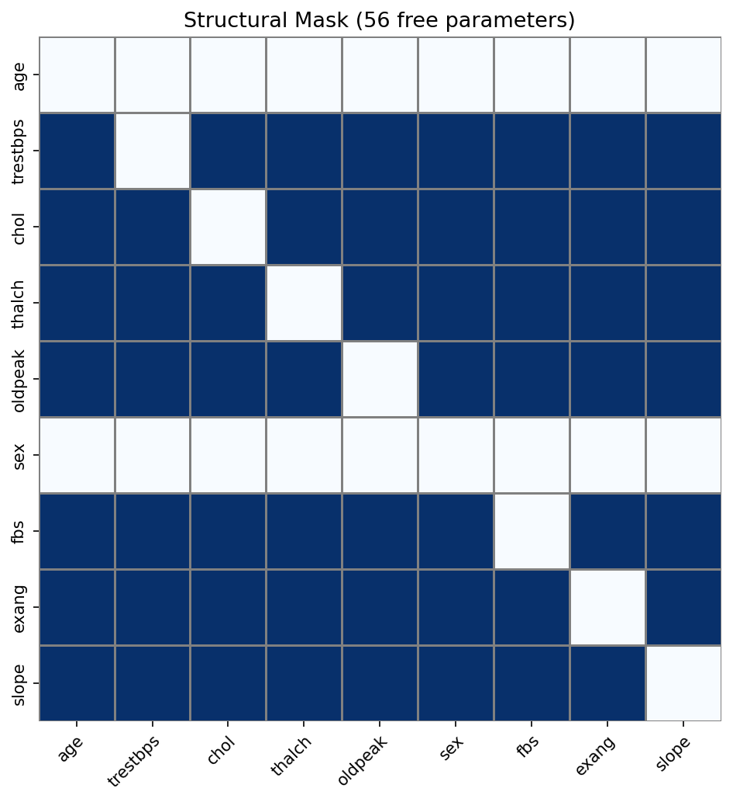

# Geometry-Aware Generalized Fisher Kernel

Code for the MSc thesis:

> Konstantinos Gkouveris, *A Geometry-Aware Generalized Fisher Kernel Framework for Binary Classification of Mixed-Type Data under Composite Likelihood*, University of Nicosia, 2026.

## Method

For each class, the model fits a masked composite likelihood on mixed continuous and ordinal variables. Per-observation score gradients from both class models are concatenated and, when `feature_type="godambe"`, whitened using the Godambe sandwich metric built from the Hessian **H** and gradient second moment **J**. A logistic regression classifier is trained on the resulting features.

Use `feature_type="raw"` for the unwhitened gradient baseline from the thesis.

## Dataset

Nine variables from the UCI Heart Disease file (5 continuous, 4 ordinal). After removing missing values across all four centers: **531 patients** (207 / 324). Data file: `data/heart_disease_uci.csv`.

## Installation

```bash
git clone https://github.com/gkouveris14-hub/geometry-aware-fisher-kernel.git
cd geometry-aware-fisher-kernel
pip install -e .
pip install -e ".[baselines]"   # optional: XGBoost
```

## Reproduce thesis results (Experiment 1)

Hand-specified mask, 5-fold stratified CV (`random_state=42`):

```bash
python examples/run_experiments.py
```

Writes `examples/outputs/results.csv`.

## Reproduce Experiment 2 (data-driven masks)

Single PC run and PC stability selection, 5-fold CV:

```bash
python examples/run_experiment2.py
```

Writes `examples/outputs/experiment2_results.csv`. Stability selection uses `B=50` bootstrap resamples by default and is slower than the single PC run.

## Cross-validation

In each fold:

1. Estimate ordinal thresholds from pooled training data (shared by class 0 and class 1).
2. Fit class-specific composite models under the same mask.
3. Build features, fit logistic regression on the training fold, evaluate on the test fold.

## Structural masks

**Hand-specified mask (Experiment 1):** set `mask="hand"` and pass a `StructuralMask` with domain constraints (age and sex exogenous).

**Single PC run (Experiment 2):** set `mask="pc"`.

```python
clf = GeometryFisherClassifier(
    mask="pc",
    mask_params={"alpha": 0.05, "exogenous": ["age", "sex"]},
    feature_type="godambe",
)
```

**PC stability selection (Experiment 2):** set `mask="stability"`.

```python
clf = GeometryFisherClassifier(
    mask="stability",
    mask_params={
        "alpha": 0.05,
        "tau_stab": 0.6,
        "B": 50,
        "exogenous": ["age", "sex"],
    },
    feature_type="godambe",
)
```

You can also build masks directly:

```python
mask = StructuralMask.from_pc_algorithm(X, variable_names, alpha=0.05, exogenous=["age", "sex"])
mask = StructuralMask.from_stability_selection(X, variable_names, B=50, exogenous=["age", "sex"])
```

## Visualizations

```bash
python examples/plot_dependencies.py
```

Figures are saved under `docs/figures/` (structural mask, class-specific dependency matrices, and their difference).

| Structural mask | Class dependencies | Difference |
|:---:|:---:|:---:|
|  |  |  |

## Example

```python
from geometry_fisher import GeometryFisherClassifier, StructuralMask, load_heart_disease

X, y, names, cont_idx, ord_idx = load_heart_disease("data/heart_disease_uci.csv")
mask = StructuralMask.from_domain_knowledge(names, exogenous=["age", "sex"])

clf = GeometryFisherClassifier(
    mask="hand",
    mask_object=mask,
    feature_type="godambe",
    lambda_reg=0.01,
    ridge_gamma=1e-3,
    scale_phi=True,
)
clf.fit(X, y, cont_idx, ord_idx, names)
```

## Module overview

| Module | Role |
|--------|------|
| `composite.py` | Class-specific composite likelihood |
| `geometry.py` | Godambe sandwich whitening |
| `features.py` | Feature map Φ(x): `raw` or `godambe` |
| `pipeline.py` | `GeometryFisherClassifier` |
| `cross_validation.py` | Stratified k-fold evaluation |
| `experiments.py` | Baseline + method comparison table |
| `structure.py` | Hand-specified and data-driven masks |
| `data.py` | Heart Disease loader |
| `visualization.py` | Dependency heatmaps |

## Tests

```bash
python -m pytest tests/ -v
```
